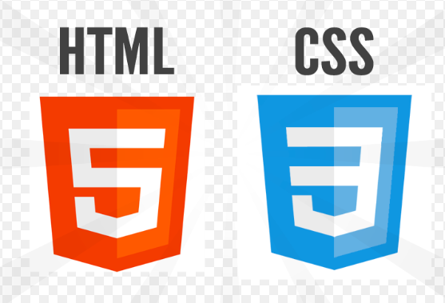
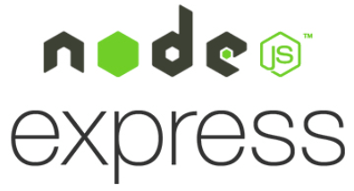
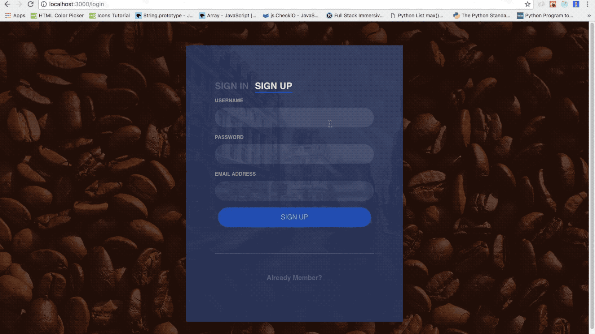

## A Full Stack ECommerce App using React / Redux with PostgreSQL database 
## FreshBakery-React App using Stripe Api

* **Front End on the app:**

* **Back End on the app:**

* **Database on the app:**

* **Purpose of the app:** 
   This e-commerce site has been built to sell coffee and bakery products online. Clients are able to choose various baked pastries and keep them in their shopping bag. They can also create their own account and make a payment by using credit cards. 
   
* **How to use:**
   Users are encouraged to register before they start shopping to get a discount for online orders. Once they register, then sign in, they can start picking the bakery and coffee products to add their shopping bag. After they finish shopping, they can make online pament by using a credit card withStripe Api.   

## Introduction video of the project: 
https://youtu.be/sPWTFYCHJx8

## User sign up & login:

## This site was built by
[Emre Akurek](https://github.com/emreyeprem)

## Database: 
This project is built using "PostgreSQL".

## Featured programs: 
JavaScript,PostgreSQL,Node,Express.js,React.js,Redux,HTML,CSS,Bootstrap.
