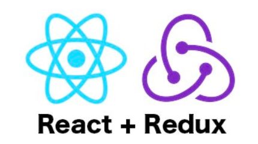

## A Full Stack ECommerce App using React / Redux with PostgreSQL database 
## FreshBakery-React App using Stripe Api

* **Purpose of the app:** 
   This e-commerce site has been built to sell coffee and bakery products online. Clients are able to choose various baked pastries and keep them in their shopping bag. They can also create their own account and make a payment by using credit cards. 
   
* **How to use:**
   Users must create a login in order to contribute to the web application. Guests are not allowed to create an article. After signing up, the user has the option to create an article, view their previous articles and view the most recent articles of the web application. If the user decides to create a new article, it will be placed in rotation to be featured on the home page as recent article. Users also have the ability to like and comment on articles posted by other users.
* **Features on the app:**
    The most popular articles are also featured on the home page as well. The popular articles are graded by the number of likes users and guests have given the article. Number of likes are not limited. While on the home page guest and users can sort through articles by the topics, such as Health, Sports, Food, Culture, etc. At any time, the guest or user may return to the home page by clicking the B.E.A.P logo. In order to exit, the user must sign-out under the profile tab. 

## Introduction video of the project: 
https://youtu.be/sPWTFYCHJx8

## This site was built by
[Emre Akurek](https://github.com/emreyeprem)

## Database: 
This project is built using "PostgreSQL".

## Featured programs: 
JavaScript,PostgreSQL,React.js,Redux,HTML,CSS,Bootstrap.
